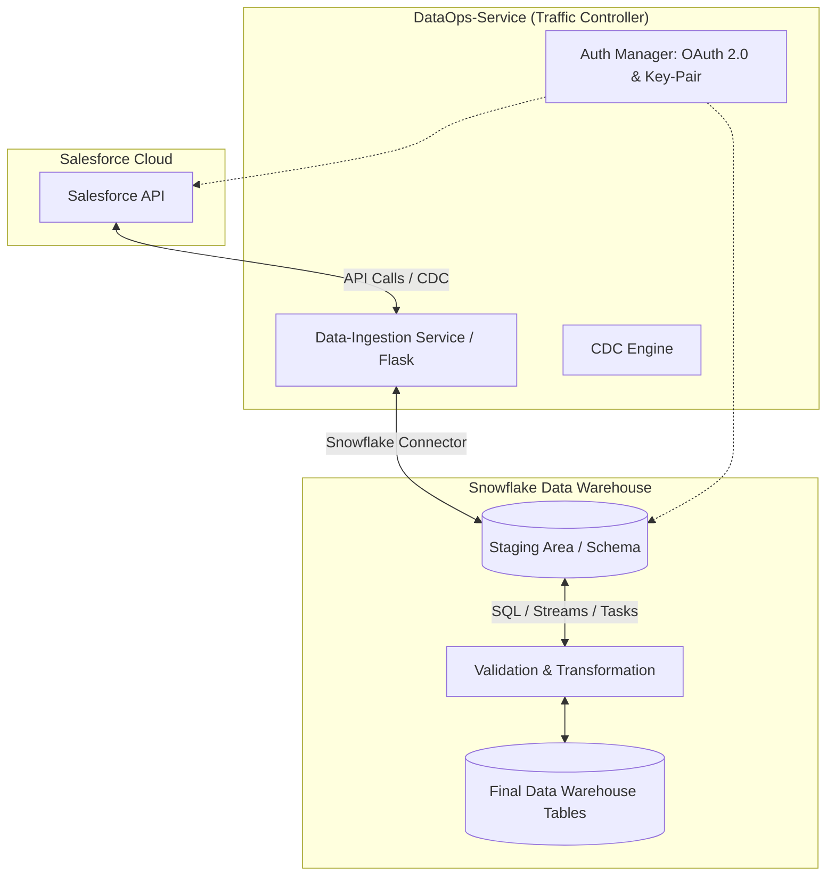

# DataOps Pipeline Architecture (Snowflake <-> Salesforce)

This document outlines the bidirectional data pipeline architecture designed by the Lead Data Architect.

## 1. System Overview

The pipeline facilitates seamless synchronization between Salesforce and Snowflake. It employs a centralized **Data-Ingestion Service** that manages the traffic flow, handles authentication, and implements Change Data Capture (CDC) to ensure efficiency.

## 2. Mermaid Diagram

## 3. Component Details

### A. Centralized Data-Ingestion Service
The core Flask-based service is the **Traffic Controller**. It handles:
- Job scheduling and execution.
- API connectivity and load balancing.
- Error handling and logging.
- Security and identity management.

### B. Ingestion Logic: Change Data Capture (CDC)
To prevent redundant API calls:
- **Salesforce to Snowflake (Inbound)**:
  - Utilize the `SystemModStamp` or `LastModifiedDate` field for each object.
  - The Ingestion Service maintains a watermark of the last successful sync timestamp.
  - Query: `SELECT * FROM Object WHERE SystemModStamp > :LastWatermark`
- **Snowflake to Salesforce (Outbound)**:
  - Implementation of **Snowflake Streams** on source tables.
  - The service polls the stream for new `INSERT`, `UPDATE`, or `DELETE` operations and sends them to the Salesforce Bulk/REST API.

### C. Security & Authentication
- **Salesforce**: OAuth 2.0 **JWT Bearer Flow**. This allows the Data-Ingestion Service to authenticate without user interaction, using a private key and a signed JWT.
- **Snowflake**: **Key-Pair Authentication**. Secured using a Private/Public key pair (PEM format). This is more secure than standard password-based authentication and is suitable for automated services.

### D. Staging Area & Validation
Before finalizing commits, data is pushed into a **Staging Area** (Landing Schema) in Snowflake.
- **Validation**: Check for data type mismatches, null constraints, and deduplication.
- **Transformation**: Flattening Salesforce JSON records into relational rows.
- **Final Commit**: Use Snowflake `MERGE` statements to upsert data from Staging to Final tables.
